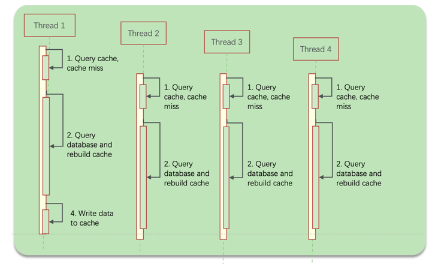
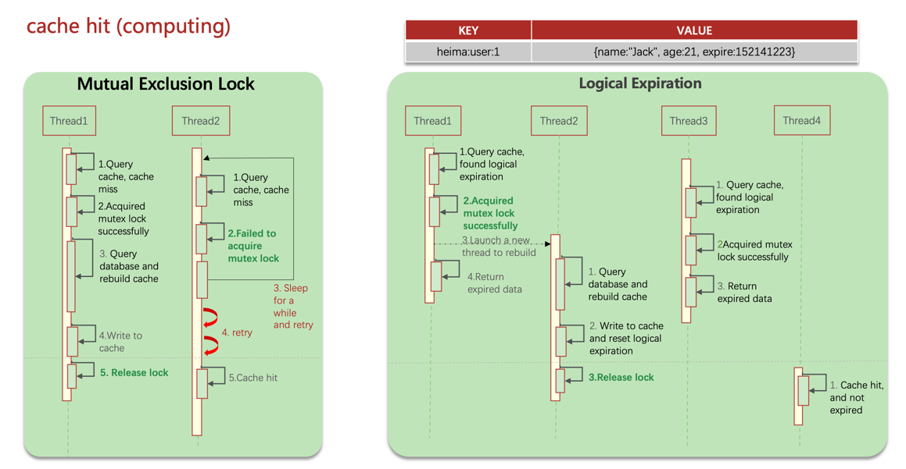
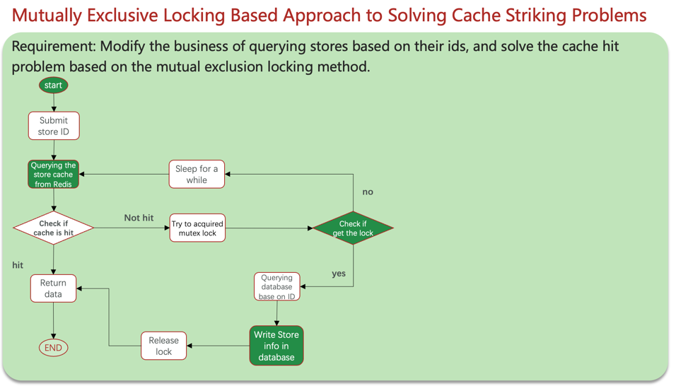
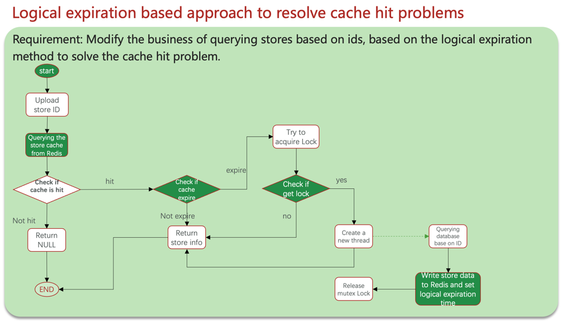
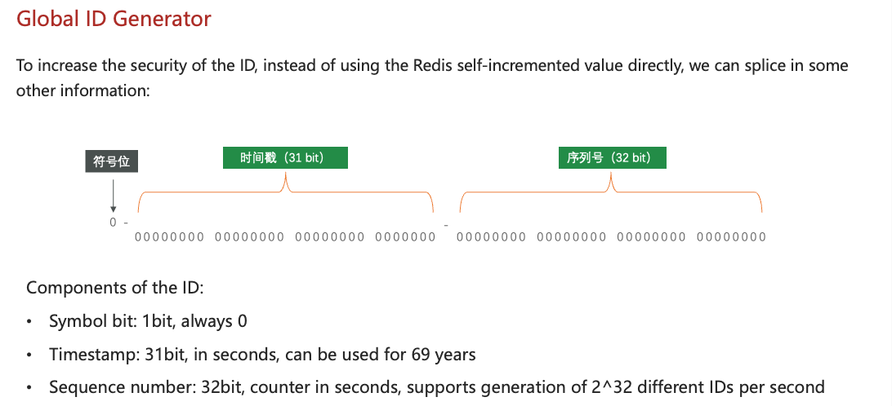
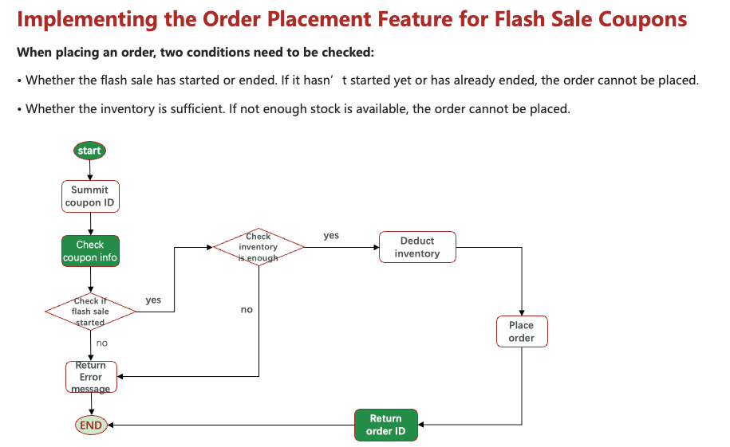
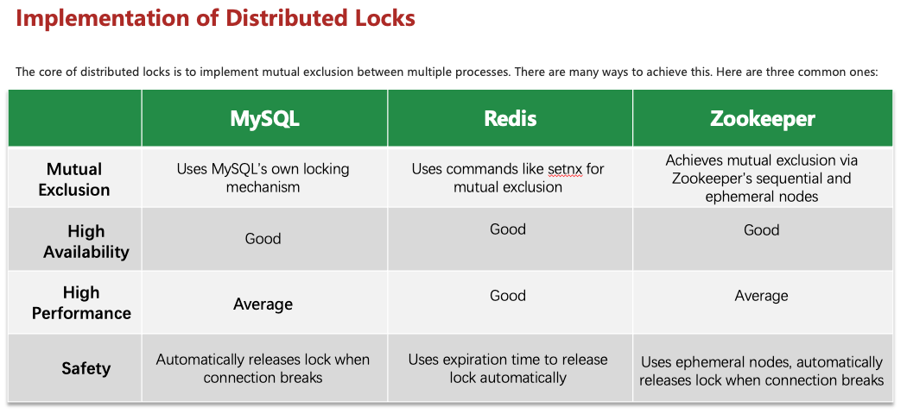
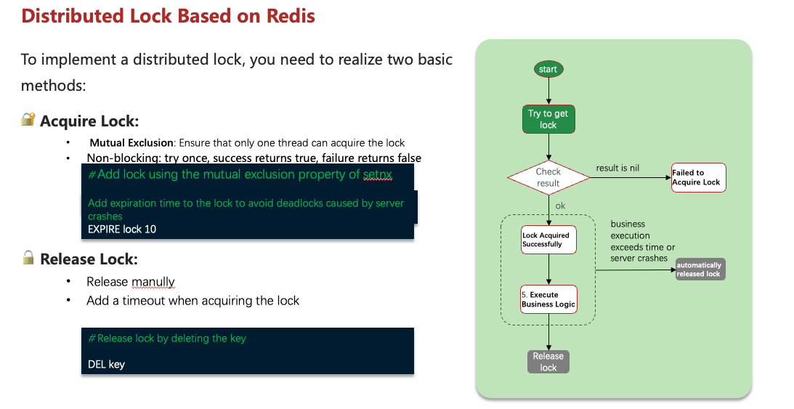
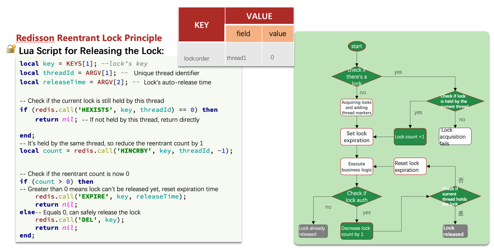
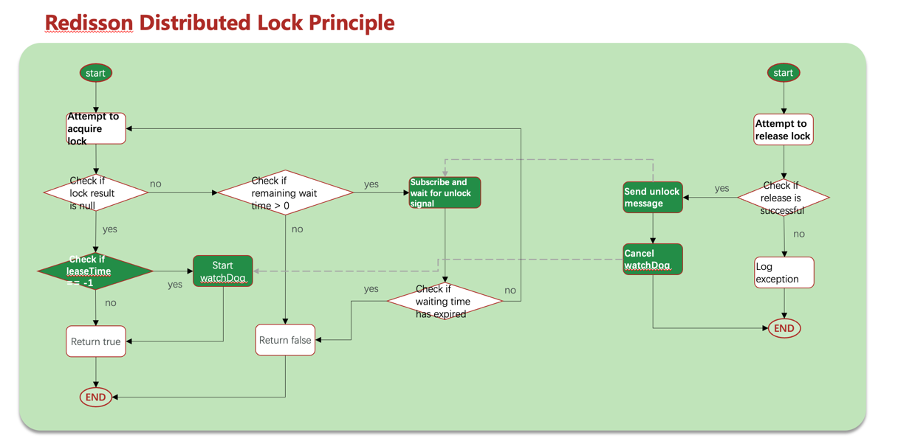

# High-Concurrency Commerce Platform

This project is an extension of my undergraduate project, link:https://github.com/JOBEBOLDER/SUPERLAND,
a spatial exploration designed to enhance the food experience by creating an immersive and interactive environment.


A high-performance e-commerce platform built with Java, Spring Boot, and Redis, focusing on solving concurrency challenges in high-traffic scenarios. This platform features optimized solutions for user authentication, merchant management, flash sales, and social interaction components.

## 🚀 Key Features Introduction:


##  project structure:


### 📱 User Authentication
- Redis-based distributed session management replacing traditional Tomcat sessions
- Token-based authentication with automatic refresh
- Secure SMS verification code login system
  #### Session Problems
  - Multiple Tomcat instances don't share session storage space, leading to data loss when requests switch to different servers.
  - Session data is also lost when servers are restarted.
  #### Session Alternatives
  - Data sharing
  - In-memory storage
  - Key-value structure
  #### Redis-based Shared Session Login
  Verification code storage using String structure
  User information storage

  String structure: Serialize objects to JSON and store in Redis.
  HASH structure: Store each field of the object separately, supporting CRUD operations on individual fields, using less memory than String.


### Interceptor Optimization
New token interceptor: responsible for refreshing the validity time of the token in redis


### 🏪 Merchant Management


#### Exercise: Store Type Query Business Add Cache
- The store type is used on the home page and several other pages, as shown here:
  
  Requirement: Modify the queryTypeList method in ShopTypeController to add query caching:
  
  Here's the markdown code for your content:


### 3. Cache Update Strategies

#### Memory Eviction:
- No need for manual maintenance. Leverage Redis's built-in memory eviction mechanism.
- When memory is insufficient, Redis will automatically evict some data.
- On the next query, the cache will be refreshed.
- **Consistency**: Weak
- **Maintenance Cost**: None

#### Timeout Expiration (TTL):
- Assign a TTL (Time-To-Live) to the cached data.
- Once it expires, Redis will automatically remove the data.
- The next query will refresh the cache.
- **Consistency**: Moderate
- **Maintenance Cost**: Low

#### Active Update:
- Implement business logic to update the cache whenever the database is updated.
- **Consistency**: Strong
- **Maintenance Cost**: High

#### 🔧 Business Scenarios:
- **Low Consistency Requirements**:
  - For data that rarely changes, you can rely on Redis's built-in memory eviction policy.
- **High Consistency Requirements**:
  - For frequently updated data, use active cache update combined with expiration time to ensure cache consistency.

---

#### 🧠 Read Operations:
- If the cache is hit: return the data directly.
- If the cache is missed: query the database first, then update the cache and set an expiration time.

---

#### 🖋️ Write Operations:
- Use the write-then-delete strategy:
  - Update the database first, then delete the Redis cache.
  - Use Spring's @Transactional annotation or TCC compensation to ensure consistency between the database and the cache.


### Ensuring Consistency Between Shop Cache and Database (Double Write Consistency)
	1.	Set expiration time during read operations
	2.	On updates: update the database first, then delete the corresponding Redis key.
Use @Transactional to ensure the operation is wrapped in a transaction.

## 5. Cache Issues

### Cache Penetration
When client requests miss both in cache and database, it's cache penetration.

**Solutions:**
* **Cache Empty Objects**: When no data exists in both cache and database, cache a null object with TTL.
  * Pros: Simple implementation
  * Cons: Extra memory consumption, potential data inconsistency
* **Bloom Filter**: A pre-filter that checks if data exists in cache. Returns immediately if not found, continues query if found

### Cache Avalanche
When a large number of cache keys expire simultaneously or Redis service crashes, causing massive requests to hit the database.

**Solutions:**
* Set different random TTL values for keys
* Improve Redis availability (using cluster solutions with sentinel mechanism)
* Add degradation and rate limiting strategies to cache services using sentinel
* Set keys to never expire (no TTL)
* Implement multi-level caching for services

### Cache Breakdown
When a hot key is accessed with high concurrency and its cache has expired, countless requests bypass the cache and directly hit the database,
as picture shown:


#### Cache Breakdown solutions:1,Mutual Exclusion Lock 2,Logical Expiration:


#### Cache Breakdown Solutions:

* **Mutual Exclusion Lock Approach**: When multiple threads query data, apply mutual exclusion locks to ensure only one thread can rebuild the cache by querying the database at any given time, while other threads wait:
  * **Pros**: Ensures data consistency
  * **Cons**: Sacrifices system availability - if reconstruction takes too long, other requests must wait. Also carries deadlock risks

* **Logical Expiration Approach**: Add a new logical expiration field to cached data. When a query arrives, first check if the current time exceeds expiration. If expired, acquire a lock and start a new thread responsible for cache rebuilding while immediately returning the old data. Other threads similarly attempt to acquire the lock - if unsuccessful, they directly return the expired data:
  * **Pros**: Better performance, greatly enhanced system availability
  * **Cons**: Additional memory consumption, prioritizes availability over consistency (sacrificing strong consistency). More complex implementation

#### 🧭 Two solutions flowchart:



### 🔥 Flash Sales System 

- 
#### Coupon Flash Sale Analysis

#### Pessimistic Lock Approach
Adding synchronization locks to make threads execute serially. Using synchronized or Lock.
* **Advantages**: Simple and direct, applies locks to shared resource objects
* **Disadvantages**: Generally lower performance

#### Optimistic Lock Approach
No locks applied, only checking whether other threads have modified the data during updates. Using CAS version number method or leveraging database row locks with UPDATE statements.
* **Advantages**: Better performance
* **Disadvantages**: Can have low success rates in high-contention scenarios

#### Coupon Flash flowchart:




# Using command to add Redis lock with expiration time

```bash
# Add lock with value, only if key doesn't exist (NX), and set expiration to 10 seconds (EX 10)
set lock value NX EX 10

# Unlock by deleting the key
del lock
```
#### Lua script manipulation of redis to achieve atomic unlock operations
```bash
unlock.lua
-- key
if (ARGV[1] == redis.call('get', KEYS[1])) then
    -- 释放锁
    return redis.call('del', KEYS[1])
end
return 0


```
#### Solving Flash Sale (Seckill) Problems Using Redisson Distributed Locks




### 👥 Social Features
- ZSET-based ranking system for popularity metrics
- Friend relationship management with mutual following detection
- Hybrid push-pull feed stream model reducing content delivery latency by 40%
- Efficient pagination with Redis sorted sets

## 🔧 Technical Implementation

### Redis Cache Solutions
- **Cache Penetration Prevention**: Empty result caching and Bloom filter implementation
- **Cache Avalanche Protection**: TTL randomization, Redis cluster with Sentinel
- **Cache Breakdown Handling**:
  - Mutex lock approach for consistency
  - Logical expiration for high availability

### Distributed Locks
- Redis-based distributed lock with Lua script for atomic operations
- Redisson implementation with reentrant lock support
- Watchdog mechanism for lock renewal

### Message Queue Patterns
- List-based blocking queue implementation
- Pub/Sub messaging for multi-consumer scenarios
- Redis Stream for persistent, acknowledged message delivery

### Feed Stream Implementation
- Timeline-based chronological content delivery
- ZSET-based scoring and ranking
- Hybrid push-pull model optimizing for different user types

## 🛠️ Tech Stack
- Java
- Spring Boot
- Redis
- MySQL
- Maven

## 🔍 Project Structure
The application follows a standard layered architecture:
- Controllers: Handle HTTP requests
- Services: Implement business logic
- Repositories: Data access layer
- Utils: Helper classes and utilities

## 📊 Performance Metrics
- 8K+ TPS during flash sales
- 15K+ daily inventory conflicts resolved
- 65% reduction in MySQL load
- 40% reduction in content delivery latency

## 📝 Usage Examples

### Login Implementation
```java
// Code examples demonstrating the login flow
```

### Flash Sale Implementation
```java
// Code examples demonstrating the flash sale mechanics
```

### Feed Stream Example
```java
// Code examples demonstrating the feed implementation
```

## 🚀 Getting Started

### Prerequisites
- JDK 11+
- Redis 6.0+
- MySQL 5.7+
- Maven 3.6+

### Installation
1. Clone the repository
```
git clone https://github.com/JOBEBOLDER/High-Concurrency-Commerce-Platform.git
```

2. Configure application properties
```
# Configure your database and Redis settings in application.yaml
```

3. Run the application
```
mvn spring-boot:run
```

## 📚 Learning Resources
This project implements various patterns and solutions discussed in Redis best practices and distributed systems design literature.

## 📄 License
[MIT](LICENSE)

## 👨‍💻 Author
JOBEBOLDER
